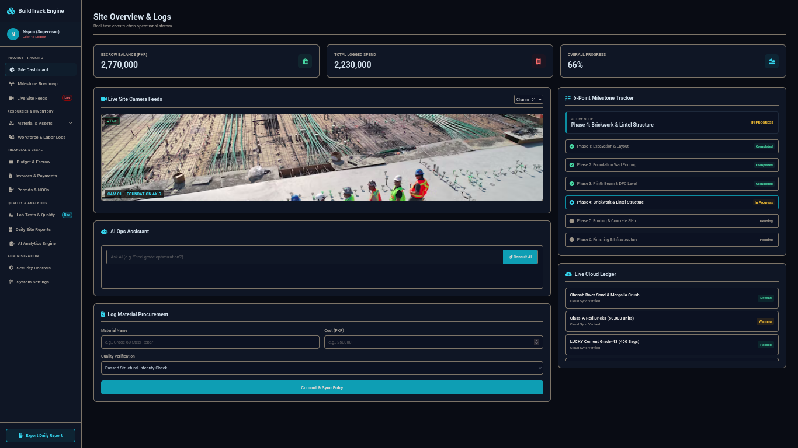
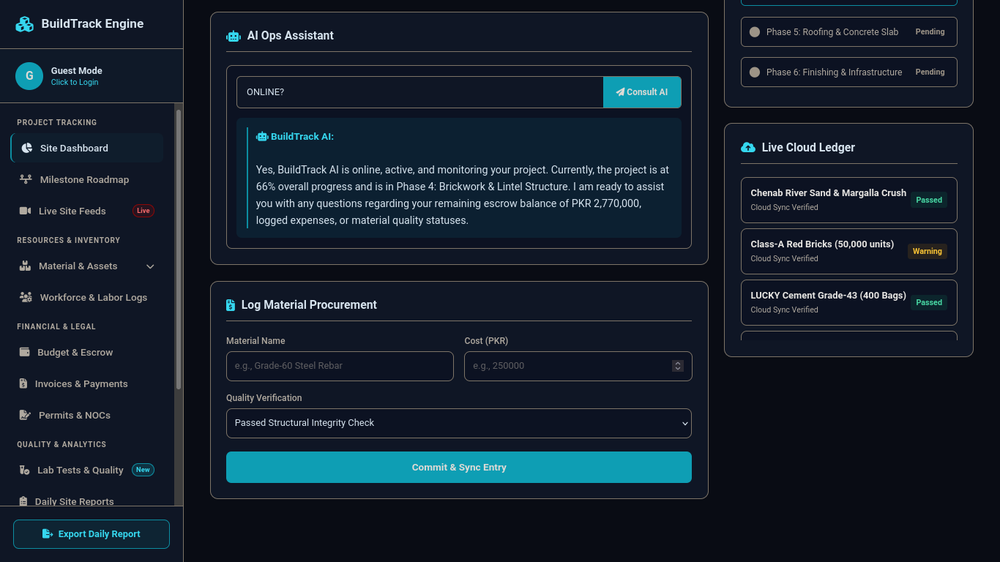
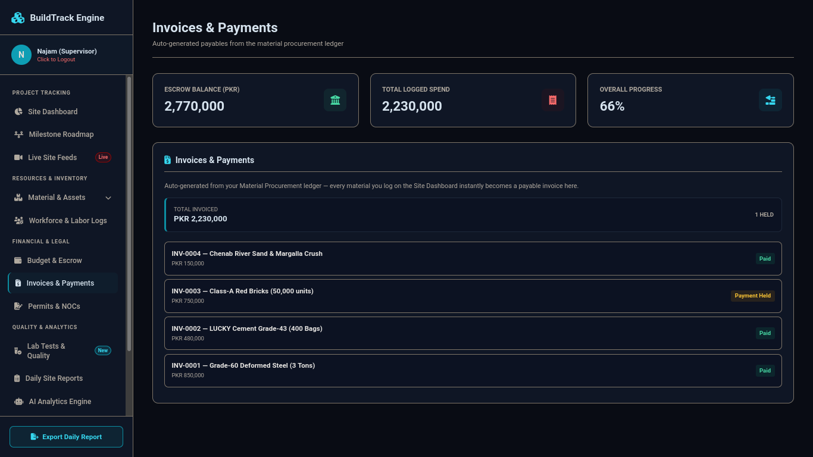

# BuildTrack Engine

**Live app:** [https://construction-transparency-app.vercel.app](https://construction-transparency-app.vercel.app)

## a. What it does & the problem it solves

Construction in Pakistan runs largely on trust — an investor or homeowner hands a
contractor a lump sum, and from that point on has almost no visibility into how the
money is actually being spent, whether materials meet quality standards, or how far
along the site really is. Disputes over "where did the money go" are one of the most
common sources of conflict between clients and contractors on small-to-mid-size
construction projects, because there's usually no shared, tamper-evident record —
just a notebook or a WhatsApp chat.

**BuildTrack Engine** is a fund-transparency and operations dashboard for a
construction site. It gives everyone with a stake in the project — the site
supervisor logging day-to-day activity, and the client/investor who wants proof of
where their money went — a single live source of truth: every material purchase,
every escrow rupee spent, every phase milestone, every security event, and every
labor day is logged in one place, timestamped, and visible in real time.

**Built for:** site supervisors who need a fast way to log site activity, and
project owners/investors who want transparency into their funds without having to
physically visit the site or take the contractor's word for it.

## b. Live deployed URL

**[https://construction-transparency-app.vercel.app](https://construction-transparency-app.vercel.app)**

Anyone can open this link and use the app — no login required to view the dashboard
(a PIN-gated Supervisor Login controls who can perform actions like toggling
security controls).

## c. Features

**Project Tracking**
- **Site Dashboard** — live camera feed selector (3 simulated site channels), material procurement form, and the full operational view in one place
- **6-Point Milestone Tracker** — construction progress automatically advances through 6 phases (Excavation → Foundation → Plinth Beam → Brickwork → Roofing → Finishing) as expenses accumulate, with a live status badge per phase

**Resources & Inventory**
- **Material Procurement Logging** — log a material purchase (name, cost, quality check result); it instantly updates the live cloud ledger, the escrow balance, and the progress percentage
- **Heavy Machinery & Logistics Register** — log equipment status (Operational/Idle/Under Maintenance) or incoming delivery status (In Transit/Delivered/Delayed)
- **Workforce & Labor Logs** — log daily attendance per worker: name, role, wage, and attendance status

**Financial & Legal**
- **Budget & Escrow** — total escrow pool, amount spent, and remaining balance, updated live from every logged material
- **Invoices & Payments** — auto-generated, not a separate data-entry form: every material logged in the ledger instantly becomes an invoice here, marked "Paid" or "Payment Held" (held if it failed quality verification), with a running total
- **Permits & NOCs** — register of permits/NOCs with issuing authority and status (Approved/Pending/Rejected)

**Quality & Analytics**
- **Lab Tests & Quality** — log material test results (e.g. concrete cube tests) with Pass/Fail/Pending outcomes
- **Daily Site Reports** — file a report with weather conditions, workers present, and a summary; builds a report history
- **AI Ops Assistant** — see below

**Administration**
- **Security Controls** — remote toggles for RFID vehicle barrier and perimeter laser array, with a live, timestamped security incident log
- **Supervisor Login** — PIN-gated authentication modal
- **System Settings** — app configuration view

Data for the Material Ledger and Security Logs is persisted in **Firebase
Firestore** and syncs in real time across sessions. The remaining modules
(Workforce, Permits, Lab Tests, Daily Reports, Machinery/Logistics) currently hold
data in-browser for the session as a working local demo — the same pattern the
Material Ledger falls back to if Firestore isn't reachable.

## d. The AI feature

**BuildTrack AI** is an operational assistant embedded in the Site Dashboard. A
supervisor can ask it a plain-language question — in English or Roman Urdu — about
the current state of the project, and it answers using the project's real, live
data rather than giving a generic response.

**How it's grounded:** before every question is sent to the model, the frontend
(`buildAIContext()` in `script.js`) snapshots the app's current state — escrow
pool, total spent, remaining balance, overall progress %, the currently active
phase, the status of all 6 phases, the 6 most recent material logs, and the 5 most
recent security events — and sends that JSON alongside the question to a serverless
function (`api/gemini.js`), which calls the Gemini API.

**The exact system prompt used** (from `api/gemini.js`):

```
You are BuildTrack AI, the operational assistant embedded inside the BuildTrack
Engine dashboard — a construction site fund-transparency and progress-tracking
app used by a site supervisor in Pakistan.

You manage exactly ONE active project. Here is its LIVE current data as JSON:
{live project data injected here as JSON}

Rules:
1. Answer using ONLY the data above. Never invent numbers, dates, or names.
2. This app tracks a single site — never ask the user for a "Project Name",
   "Job Number", or "Escrow Account ID". If something isn't in the data
   provided, say plainly that it isn't tracked yet, don't ask for identifiers.
3. Currency is PKR — format large numbers with commas (e.g. "PKR 1,250,000").
4. If the user writes in Roman Urdu, reply in Roman Urdu. If they write in
   English, reply in English.
5. Keep replies concise: 2-4 sentences, unless the user explicitly asks for a
   detailed breakdown.

User question: {the user's typed question}
```

**Example:** asking *"what is current escrow balance"* returns the real remaining
balance computed from `escrowPoolTotal - totalExpensesLogged`, not a generic
"please provide your account ID" response — because that number is sitting right
in the JSON the model was given.

## e. Tools, services, and models used

- **Frontend:** vanilla HTML, CSS, and JavaScript — no framework
- **Hosting/Deployment:** [Vercel](https://vercel.com) (static hosting + serverless function for the AI endpoint)
- **AI model:** Google **Gemini 3.5 Flash**, via the Gemini API (`generateContent` endpoint)
- **Database:** [Firebase Firestore](https://firebase.google.com/products/firestore) — real-time sync for the material ledger and security logs
- **Icons:** Font Awesome 6.4.0
- **Version control:** Git / GitHub

## f. Screenshots

> Add at least 3 screenshots below before submitting. See "Adding your
> screenshots" in the run instructions.


*Site Dashboard — live camera feed, milestone tracker, and material ledger*


*BuildTrack AI answering a question grounded in live project data*


*Invoices auto-generated from the material procurement ledger*

## g. How to run this project

### Option 1 — just use the live version
Open **[construction-transparency-app.vercel.app](https://construction-transparency-app.vercel.app)** — no setup needed.

### Option 2 — run it locally

**Prerequisites:** [Node.js](https://nodejs.org), a free [Vercel](https://vercel.com) account, and a free [Gemini API key](https://aistudio.google.com/apikey).

```bash
# 1. Clone the repo
git clone https://github.com/najampro/construction-transparency-app.git
cd construction-transparency-app

# 2. Install the Vercel CLI (needed to run the serverless AI function locally)
npm install -g vercel

# 3. Link the project and pull/set environment variables
vercel login
vercel link
vercel env add GEMINI_API_KEY    # paste your Gemini API key when prompted

# 4. Run the dev server (serves the static site AND the /api/gemini function)
vercel dev
```

Then open the local URL it prints (typically `http://localhost:3000`).

> **Note:** opening `index.html` directly in a browser (double-clicking the file)
> will load the dashboard, but the AI Assistant will not work — it depends on the
> `/api/gemini` serverless function, which only runs under `vercel dev` or on the
> live Vercel deployment.

Firebase is already configured in `script.js` for material ledger and security
log persistence; if Firestore is unreachable, those two modules automatically
fall back to local in-browser storage for the session.

